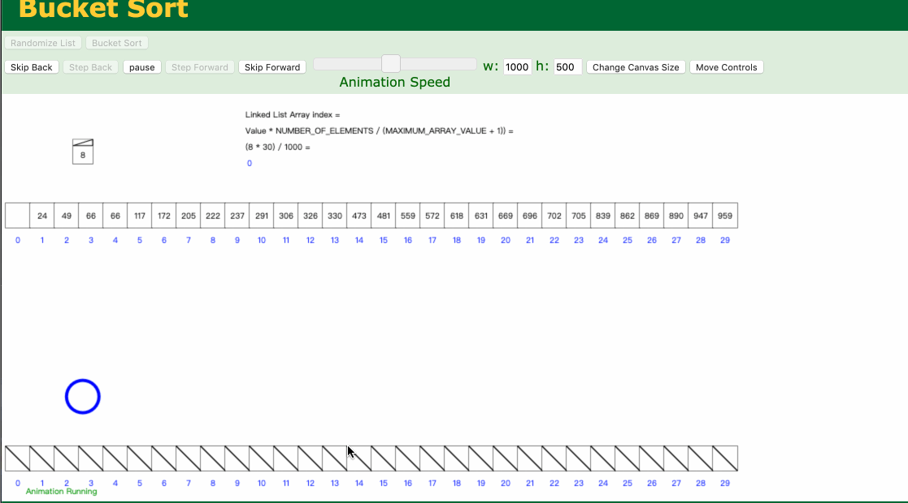

### 原理

桶排序是计数排序的升级版。它利用了函数的映射关系, 高效与否的关键就在于这个映射函数的确定。为了使桶排序更加高效, 我们需要做到这两点:

- 在额外空间充足的情况下, 尽量增大桶的数量
- 使用的映射函数能够将输入的 `N` 个数据均匀的分配到 `K` 个桶中

同时, 对于桶中元素的排序, 选择何种比较排序算法对于性能的影响至关重要。

- 什么时候最快
  当输入的数据可以均匀的分配到每一个桶中。
- 什么时候最慢
  当输入的数据被分配到了同一个桶中。

### 算法步骤

### 参考

[bucketSort](https://github.com/Rain120/JS-Sorting-Algorithm/blob/master/9.bucketSort.md)

[Data Structure Visualizations: BucketSort](https://www.cs.usfca.edu/~galles/visualization/BucketSort.html)

[排序算法之桶排序的深入理解以及性能分析](https://dailc.github.io/2016/12/03/baseKnowlenge_algorithm_sort_bucketSort.html)
