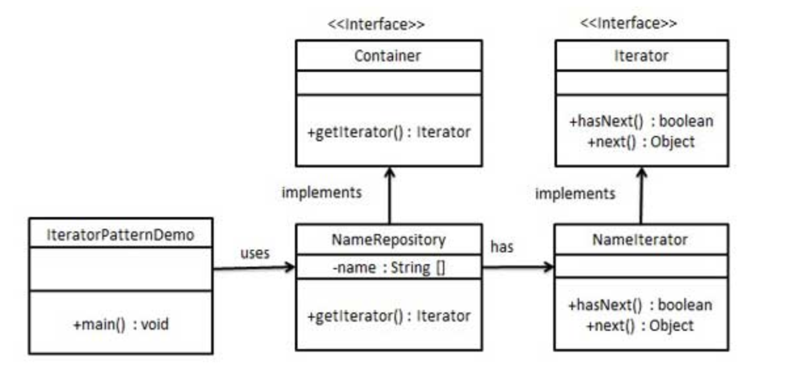

### 迭代器模式

迭代器模式(`Iterator Pattern`)是最简单的设计模式之一。它可以让用户透过特定的接口访问容器中的每一个元素而不用了解底层的实现。

迭代器模式属于行为型模式。

### UML 类图

##### 传统的 Java 类图

##### JavaScript 类图

### 作用

不同的方式来遍历整个整合对象。

### 优缺点

##### 优点

- 支持以不同的方式遍历一个聚合对象。 

- 迭代器简化了聚合类。 

- 在同一个聚合上可以有多个遍历。

- 在迭代器模式中，增加新的聚合类和迭代器类都很方便，无须修改原有代码。

##### 缺点

- 由于迭代器模式将存储数据和遍历数据的职责分离，增加新的聚合类需要对应增加新的迭代器类，类的个数成对增加，这在一定程度上增加了系统的复杂性

### 场景

- [for-of](https://developer.mozilla.org/zh-CN/docs/Web/JavaScript/Reference/Statements/for...of)

- [Iterator](http://es6.ruanyifeng.com/#docs/iterator)

- [Map, Set](http://es6.ruanyifeng.com/#docs/set-map)

### 参考

[迭代器模式](https://zh.wikipedia.org/zh-cn/%E8%BF%AD%E4%BB%A3%E5%99%A8%E6%A8%A1%E5%BC%8F)