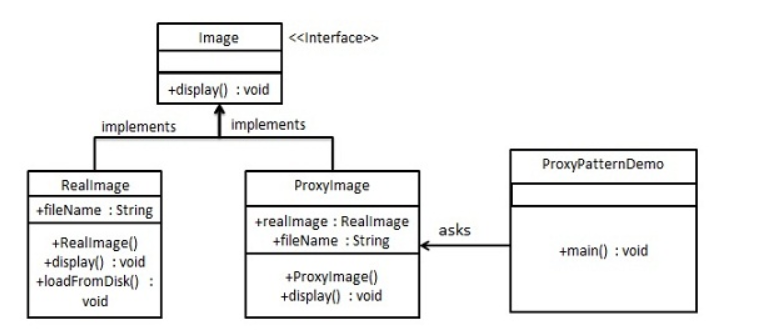

### 观察者模式

一种设计模式, 为其他对象提供一个代理以控制对某个对象的访问, 即通过代理对象访问目标对象。

### UML 类图

##### 传统的 Java 类图

##### JavaScript 类图

### 作用

为其他对象提供一种代理以控制对这个对象的访问。

### 优缺点

##### 优点

- 职责清晰

- 高扩展性, 可以在目标对象实现的基础上, 增强额外的功能操作, 即扩展目标对象的功能

- 智能化

##### 缺点

- 由于在客户端和真实主题之间增加了代理对象, 因此有些类型的代理模式可能会造成请求的处理速度变慢。

- 实现代理模式需要额外的工作, 有些代理模式的实现非常复杂。

### 场景

- ES6 Proxy

- 代理

  - 外网代理

  - 远程代理

  - Cache代理

### 参考

[代理模式](https://zh.wikipedia.org/wiki/%E4%BB%A3%E7%90%86%E6%A8%A1%E5%BC%8F)
